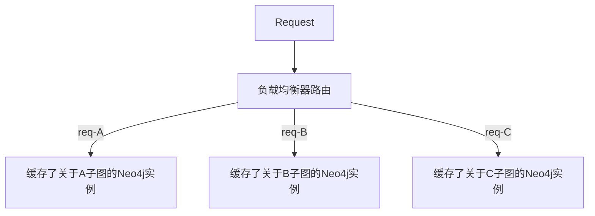

该文档记录《图数据库》读书笔记

**重点：Neo4j对于`Node`, `Relation`, `Property`, `Label`等存储形式，可参考[这里](https://blog.csdn.net/bluejoe2000/article/details/72978478)**

> 对于变长值（如数组/字符串等），使用链表Linked的形式，类似固定长度`block`分页的处理

## Chapter 1 & 2

1. 图数据库中，联系（即“有向边”）为一等公民
2. 带标签的属性图模型
   - 由节点、联系（即有向边）、属性、标签组成
   - 节点可有：
     - 标签：可以有多个，表明节点的角色
     - 属性：键值对
   - 联系（有向边）可有：
     - 方向
     - 名字：表明联系的意义
     - 起始节点和终止节点
     - 属性：给图算法提供元数据，或者增加联系的额外语义
   - *标识符
     - **仅在当前查询范围内可用**

## Chapter 3

Cypher CQL（TODO: 高级特性需要通过后文补充）

1. `MATCH`

   类似SQL的`SELECT` ，匹配用，如：

   ```CQL
   MATCH (a:Person {name:'Jim'}) -[:KNOWS]-> (b) -[:KNOWS]-> (c), (a) -[:KNOWS]-> (c) 
   RETURN b, c
   ```

   这里`MATCH`把属性`name='Jim'`的`Person`节点绑定在标识符`a`上, `b`和`c`类似..若有多个节点满足条件,则将`a`绑定到所有这些节点上

   联系表示如下：

   - 表明一个有指向的联系可用`-[relation-id:relation-name]->`或者`<-[relation-id:relation-name]-`表示，`relation-id`可省略
   - 无指向联系为`-[relation-id:relation-name]-`
   - 联系中表示长度可变：`-[relation-id:relation-name*low...up]-`/`-[relation-id:relation-name*low...up]->`（前者没规定方向，后者规定了方向）表示长度可变的路径，最小长度为`low`，最大为`up`
   - 联系中使用`|`表示“或”语义
   - `()`可表明一个匿名节点

2. `RETURN`，返回结果，最简单的查询是`MATCH & RETURN `字句，如上述样例

   - 让返回结果唯一，只需`RETURN DISTINCT <id> [AS <alias>]`即可
   - 可使用类似于SQL的聚合函数，如`count`(计数)，`length`(路径长度)，只需`RETURN count(<id>)`即可

3. `ORDER BY`

   排序，默认升序，降序只需添加`DESC`。如：`ORDER BY count_p DESC`

4. `WHERE`

   类似SQL的`WHERE`，可把上述样例改写为

   ```CQL
   MATCH (a:Person) -[:KNOWS]-> (b) -[:KNOWS]-> (c), (a) -[:KNOWS]-> (c)
   WHERE a.name = 'Jim'
   RETURN b, c
   ```

5. `CREATE`

   - 用于创建节点和联系，若单独使用，则永远会创建新节点/联系，下面是用已有的a节点，创建一个新节点b(有属性Ian)，并给2节点创建新联系

   ```CQL
   MATCH (a:Person {name:'Jim'}) 
   CREATE (a) -[:KNOWS]-> (b:Person {name:'Ian'}
   RETURN a, b
   ```

   - 若要通过已有节点和联系创建，需要搭配`MATCH`，如给以下2个已有节点创建联系，注意，**使用已有节点不需要对节点声明标签**：

   ```CQL
   MATCH (a:Person {name:'Ian'}),(b:Person {name:'Emil'}) 
   CREATE (a) -[:KNOWS]-> (b) 
   RETURN a, b
   ```

   - 创建索引，可加速查询，格式为`CREATE INDEX ON :<label>(<prop-key>)`

   ```CQL
   CREATE INDEX ON :Person(name)
   ```

   - 创建限制，如下是创建唯一的限制

   ```CQL
   CREATE CONSTRAINT ON (p:Person) ASSERT p.name IS UNIQUE
   ```

6. `MERGE`

   等效`MATCH + CREATE`。当查找时，若找到匹配断言的节点和联系，则复用，否则就直接创建。

   规则是：**用`MERGE`匹配，模式中所有的元素必须全部存在；若不能匹配所有部分，那么`MERGE`会创建一个完全模式的全新实例**

   如，若没找到`School`节点，则创建时执行`SET`动作：

   ```CQL
   MERGE {m:School {name: 'ABC'}}
   ON CREATE
          SET m.address = 'AAA'
   RETURN m
   ```

   又如，若对于已有的2节点，若关系不存在，则创建联系时执行`SET`动作（这里`MATCH`不能省略，否则当联系不存在时，2个节点都会新创建出来，即匹配必须全部满足才行，否则全部用于创建新的）：

   ```cypher
   MATCH (m:School {name:'AAA'}), (p:Person {name:'PPP'})
   MERGE (p) -[r:ACTED_IN]->(m)
   ON CREATE 
         SET r.roles = ['teacher']
   RETURN p, r, m
   ```

7. `DELETE`:删除节点和联系，要和`MATCH`字句使用

   下例是删除属性`name`为`Jim`的`Person`节点所有的邻接节点和对应的联系

   ```CQL
   MATCH (a:Person) -[r]-> (b)
   WHERE a.name = 'Jim'
   DELETE r, b
   ```

8. `REMOVE`: 删除标签和属性，同`DELETE`用法

9. `SET`：设置节点/联系的属性值，常与`MATCH`字句配合使用

   如下所示，设置节点属性：

   ```CQL
   MATCH (a:Person {name:'Ian'})
   SET a.name = 'AAA'
   RETURN a
   ```

10. `SKIP`&`LIMIT`: 分页，分别对应`offset`和`count`

11. `UNION`: 取2个`MATCH`字句的并集，若加`ALL`则结果条目会有重复

12. `IN`：判断是否属于一个集合，格式: `IN [collections-of-value]`

13. `FOREACH`: 对列表每个元素执行更新操作

14. `WITH`：链式查询，类似SQL的`WITH`，将上一步的查询结果转移到下一步查询/返回中，如

    ```CQL
    MATCH (bard:Author {lastname:'Shakespeare'}) -[w:WROTE_PLAY]-> (play)
    WITH play
    ORDER BY w.year
    RETURN collect(play.title) AS plays
    ```

建模：

- 常用名字可用作标签，如`User`,`Email`
- 带宾语动作可作为联系，如`SENT`,`WROTE`
- 合适的每次指代一个实体时，建模成节点，用属性记录它的特点
- 避免反模式（即把实体建模成联系）

## Chapter 4

### 1. 应用程序架构

**a) 嵌入式Neo4j**

优点：低延迟、任选API、显式事务；

注意点：仅用于JVM、GC行为、数据库生命周期。

嵌入式版本和服务器版本一样，可做成集群，实现高可用性和水平读扩展。

一般更新先应用于嵌入式版，如何复制到服务器版。

**b) 服务器模式**

优点：使用REST API（默认访问方式）、平台独立、扩展独立（独立于应用服务器集群来扩展数据库集群），与应用程序GC行为隔离

注意点：网络开销、事务状态（需要扩展维护事务状态，因为客户端无法完成事务时服务端依旧维护事务状态直到超时，这时候需要对API进行扩展）

**c) 服务器扩展**

对REST API进行扩展，或者取代原有的REST API

扩展优点：支持复杂事务、更好API选择、利于封装、可自定义响应格式

注意点：仅用于JVM、GC行为

### 2. 集群

Neo4j使用主从复制实现高可用性和水平读扩展

**a) 复制**

所有集群的写入都通过主节点协调完成。

可从某个节点写入，但是写入会先被同步到主节点。

而写入主节点后，主节点会将其复制到一些从节点上。(配置项`ha.tx_push_factor`和`ha.tx_push_strategy`)

建议所有写操作都通过主节点，这种操作更加快速。

**b) 使用队列写入缓冲区**

在高写入负载下，用队列来进行缓冲区写入和负载调节。

将写入缓冲到队列，如何工作节点对队列沦陷并对数据库批量写入。

优点：控制流量、降低竞争、能在不拒绝客户端请求下进行暂停写入的维护操作

(参考实习时的Micro-task框架)

### 3. 负载均衡

Neo4j本身无负载均衡功能，需要以来网络基础设施。

**a) 分离读写流量**

通过引入负载均衡器（不能单纯通过HTTP方法），将写流量定向到主节点，读流量平衡分散到整个集群

**b) 高速缓存分片**

首先是2个概念：

- 分片(Sharding): 将数据库（database）分成多个没有共同点的小型数据库，且它们可以跨多台服务器传播。其动作类似于水平分区。
- 分区(Partition): 
  - 水平分区：对表的行进行分区，如一个包含10年记录的表可被分为10个不同分区（每一年一个分区）。
  - 垂直分区：垂直划分列来减少目标表的宽度，使某些特定的列被划分到特定的分区，每个分区都包含了其中的列所对应的行。

高速缓存分片指：将请求**路由**（一致性路由技术）到HA（高可用性）集群的特定实例上，这个实例很可能已经将需要使用的图的一部分放置在了主存储器中了。（即**集群中，每个实例缓存了整个图的一部分，不同实例缓存的部分不同，类似于水平的分片**）



这提高了命中缓存的几率。

**c) 读取自己的写入**

在需要读取刚刚写入的数据时，由于写是往主节点写，读是在从节点读，可能在读取时不能反映写入的结果。

解决办法是利用b)中的路由技术，将写入操作路由到用于响应后续的读取请求的从节点上，而不是写到主节点上。

但是这种方法会慢一个数量级，应减少应用这种技术。

### 4. 容量规划

**a) 性能**

优化选项：

- JVM堆大小
- 存储映射到页缓存的存储百分比
- 存储设备（SSD等）

准则：

- 尽可能多利用页缓存，尽可能多将存储文件映射到高速缓存中
- 调整JVM堆大小，监控GC
- 考虑更高速度的存储设备

**b) 冗余**

保证可用性（即可以忍受集群中多少台机器宕机）

要通过冗余多个实例，当集群中一些实例宕机时，整个集群依旧保持可用状态

**c) 负载**

一个经验公式：

`并发请求数 = (1000/平均请求时间(ms))*每个机器内核数*机器数量`

可用于量化可扩展性（用每台机器处理多少并发请求作为每个计算量）

- 平均请求时间：对于典型数据集，从接受请求到发出响应的时间
- 并发请求数量：需要区分平均负载和峰值负载

### 5. 导入和加载数据

**a) 初始导入**

使用工具`neo4j-import`，没有支持常规事务能力，使用类栅格模式，仅当导入操作完成，存储才是一致的。

**b) 批量导入**

使用命令`LOAD CSV`

导入大量数据时，为了高效，还需考虑：

- 对已有图建立索引

  对于大量`MERGE`操作，显然从O(N)复杂度降到O(logN)，性能有大提升。

  若导入后索引不需要，可以最后删除（`DROP INDEX ON :<label>(<prop-key>)`

- 通过数据库的事务流

  Neo4j实例的更新都是事务型的，`LOAD CSV`也是。

  对大量批量导入操作，可能非常不高效，因为数据库需要管理大量事务状态

  可使用`PERIODIC COMMIT <line-no>`来将一个大的事务分解成许多连续进行的小事务提交来改善性能

## Chapter 6：内部结构

Neo4j是支持**原生图处理**和**原生图存储**的

### 1. 原生图处理

**免索引邻接**

即每个节点都会维护其邻接节点的引用（维护一组入IN引用和一组出OUT引用）。（非原生的要维护全局索引/表，对于M步查找，非原生要O(MlogN)，每一步查找索引为O(logN)，而原生只要O(M)，查找邻接点只要O(1)）

它让“连接”的代价变得很小，尤其是对于双向的联系

### 2. 原生图存储（毕设可参考这样开发缓存）

**a) Neo4j架构**

自上而下：

- Traversal Framework, Core API, Cypher
- 锁管理器、页面缓存、记录文件、事务管理、事务日志
- 磁盘文件

**b) 存储**

Neo4j将节点、联系、标签、属性独立存储

1. 节点

   存储在`neostore.nodestore.db`。

   节点大小固定，15字节，每个节点根据ID相邻存储，可根据ID直接`seek`到对应存储位置，因此很快：

   - `inUse`：1字节，表明节点是否在使用（是用于存储的节点还是可以回收用于表示一个新的节点，它会被`.id`文件跟踪）
   - `nextRelId`：4字节，关联到该节点的第一个联系
   - `nextPropId`：4字节，关联到该节点的第一个属性
   - `labels`：5字节，指向该节点的标签存储（若标签少，则内联到该区域）
   - `extra`：1字节，标志保留位

2. 联系

   存储在`neostore.relationshipstore.db`。

   联系大小固定，34字节，每个联系存储方式和节点一样：

   - `inUse`：1字节，表面联系是否在使用
   - `firstNode`：4字节，起始节点ID
   - `secondNode`：4字节，结束节点ID
   - `relationshipType`：4字节，联系的类型指针
   - `firstPrevRelId`,`firstNextRelId`：各4字节，表示起始节点的上一个联系ID和下一个联系ID
   - `secondPrevRelId`,`secondNextRelId`：各4字节，表示结束节点的上一个联系ID和下一个联系ID
   - `nextPropId`：4字节，联系的第一个属性ID
   - `firstInChainMarker`：1字节，指示当前记录是否位于联系链表的头部

   具体可参考这张图：

   

   遍历一个节点到另一个节点的联系，只要执行：

   - 从给定节点记录定位到联系链表（双向链表）的第一个记录位置（可通过ID偏移量计算）
   - 遍历联系链表，匹配第二个节点ID即可

3. 属性

   以键值对方式持久化用户数据

   属性记录也是固定大小，存储方式和节点相同。

   一个属性在磁盘上包括：

   - 4个属性块（属性记录可占据1~4个）
   - 属性链的下一个属性ID（所以属性记录是一个单链表）

   而属性记录包含了：属性类型、属性索引文件（存储属性的名称，`neostore.propertystore.db.index`）,而属性值，记录包含了一个动态存储记录的指针或者内联值。指针指向2种存储：动态字符串存储(`neostore.propertystore.db.strings`)和动态数组存储(`neostore.propertystore.db.arrays`)，这些值由固定大小的链表组成。

4. 堆外缓存提升性能

   使用LRU-K算法置换页缓存；对于高速缓存，置换基于算法LFU。

### 3. API

**a) 内核API**

位于最底层，是事务事件处理程序，允许用户代码在事务流经内核时监听事务，并基于此进行响应。

**b) Core API**

命令式Java API，将图基本元素暴露给用户（节点、联系、属性、标签等）

读取时，API被延迟执行，当代码请求下一个节点时联系才会被遍历；数据会尽快从图中取回，调用者可在任何地方终止遍历

写入时，核心API提供事务管理功能，保证ACID。

Core API与底层存储的关系很密切

**c) Traversal Framework**

声明式Java API，可指定约束来限制遍历图的部分（如联系类型、方向），可指定遍历方式，并可以指定用户定义的路径识别器（决定下一步的走向），如下例：

```java
Traversal.description()
  .relationships(XXRelationships.PLAYED, Direction.INCOMING) //指定联系类型和方向
  .breathFirst() //以BFS遍历图
  .evaluator( //用户定义路径识别器,决定下一步动作
  (path) -> {
    if(path.endNode().hasRelationship(XXRelationships.XX))
      return Evaluation.INCLUDE_AND_CONTINUE;
    else
      return Evaluation.EXCLUDE_AND_CONTINUE;
  }
);
```

Traversal Framework更加松耦合。

### 4. 非功能型特性

**a) 事务**

Neo4j的事务和RDBMS的事务语义相同。Neo4j的写是有事务控制的。

如写操作时：

- 给相关节点和联系加写锁
- 写入完成（提交）后，写入同步到磁盘上进行持久化，并释放写锁
- 写入失败，该操作丢弃，写锁释放，并恢复到写操作前的状态
- 多个事务尝试同时更改相同元素时，Neo4j先检测死锁，然后对这些事务进行**序列化**
- 单个事务上下文中的写操作对其他事务不可见，保证隔离性

事务实现：

- 每个事务被表示为一个内存对象，同时数据库状态被设为“写状态”
- 事务对象由锁管理器提供支持，在节点、联系更改时为它们加锁
- 事务失败：事务对象丢弃，写锁释放
- 事务成功：提交到磁盘，写锁释放
- 写入磁盘会使用预写日志，这和RDBMS类似

**b) 可恢复性**

本地恢复：根据日志来进行Undo和Redo，使其恢复到宕机前的状态（可参考《数据库系统概念》）

集群恢复：若一个实例本地恢复了，它可以快速从其它集群中的实例（通常是主节点）进行同步（寻求新的事务），从而保证了故障后续所有成功提交的事务的一致性。

**c) 可用性**

Neo4j使用**主从集群**确保每个机器上存储一个完整的图，其部署拓扑为：主节点写，从节点读

- 写入操作频繁从主节点复制到从节点
- 任何时刻：主节点和一些从节点有最新的副本，其他节点会去同步

Neo4j也支持从节点写

- 首先保证与主节点的一致性（与主节点同步），然后写入跨这2个实例进行同步，这导致了**更高的写入延迟**
- 并不保证其它从节点的一致性——其它从节点依旧需要和主节点同步，写操作依旧需要通过主节点

资源竞争，图的访问模式更加容易均匀地分布和延伸，竞争会降低

**d) 可扩展性**

1. 容量（图的规模）

   维护“甜蜜点”（见前面章节），优化使图的规模满足95%左右的用例，同时实现更快的较少的存储。

2. 延迟（响应时间）

   图数据库没有RDBMS遇到的问题（因为数据越多，RDBMS作连接时间越长），图数据库遍历连接速度很快（遍历指针+模式匹配即可），时间只取决于被查询到的数据大小。

3. 吞吐量

   Neo4j可以直接建立一个集群，横向扩展达到高可用性和高读取吞吐量（读>写场景）

   规模超过集群承载能力，可以在应用程序中创建分片来跨数据库实例展开图，对图进行切分（读写横向扩展，但是这被认为是NP-Hard问题）

   - 一种实现方法是寻找最小割点，从而最小化跨机器遍历
   - 另一种：创建合成键，然后通过这些键以及应用程序级的分辨算法，通过应用程序层关联记录

## Chapter 7：图论预分析

### 1. DFS & BFS

算法是很简单的。DFS作为基本遍历策略。

Neo4j应用的该算法是带有决策能力的，缩短了执行时间

### 2. Dijkstra Algorithm

最短路算法，略过（因为写烂了），最坏情况下为O(R + NlogN)，若用Fibonacci Heap可以更加小。

### 3. A* Algorithm

Dijkstra算法改进，基于一些有决策能力的查询的观察结果，通过决策，对那些遍历的路径图做出更好选择

算法流程类似，而路径成本分为2个部分：`f(n) = g(n) + h(n)`，`g(n)`为路径成本，`h(n)`为估算成本（由启发式的算法计算，若不算入该部分，就是Dijkstra算法）

A*算法在迭代图时会对`g(n)`和`h(n)`进行平衡，让`f(n)`变得最低

### 4. 图论与预测建模

**a) 三元闭包**

若一个子图拥有节点A，A与B和C存在强联系（即有边），则该子图有强三元属性，B和C至少有弱联系，很有可能是强联系（此时形成三元闭包）。这在社交图中可用于预测。

**b) 结构平衡**

该理论主要研究三人间的友好和敌对关联，认为我敌人的朋友是我的敌人的社会关系比我朋友的朋友是我敌人更为常见，也更稳定。

多个三元闭包中，可以去找平衡的三元闭包，让预测更加准确。

### 5. 局部桥

局部桥和强三元闭包这2个属性意义相反。局部桥的相同属性是弱连接。

它描述组织中不同群组间的沟通渠道。应该要保证局部桥的联系是健康和活跃的。