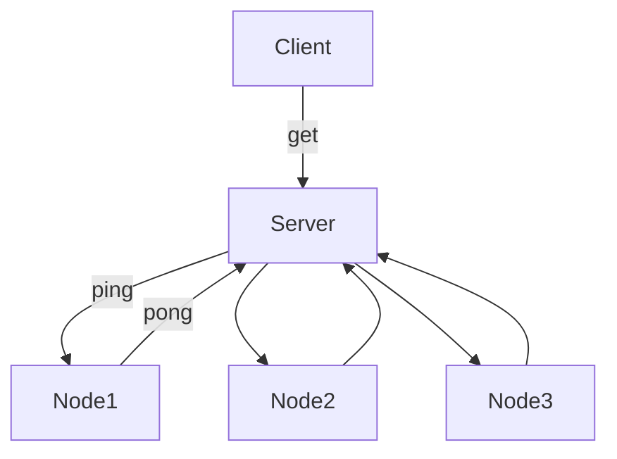

# 分布式系统理论概述

## 1. CAP

CAP理论各字母含义：

- Consistency: 一致性，分布式系统中所有数据备份，相同时刻是否有相同的值
- Availability: 可用性，集群中某部分节点不可用，集群整体是否能响应客户端读写请求
- Partitional Tolerance: 分区容忍性，系统如果不能在一定时间内达成数据一致性，则发生了（网络）分区的情况（即允许节点间丢失任意多的信息）

CAP不能全部满足：

- CA：其实P一直存在，只能保证子系统CA保证。例子为单点数据库，LDAP。
- CP：每个Server都要强一致，分区容忍导致同步时间无限延长，牺牲了可用性。例子有传统分布式数据库事务、分布式锁。
- AP：放弃强一致性，分区发生，节点直接可能失去联系，而高可用让每个节点只能用本地数据提供服务，导致全局数据不一致。例子有现有众多NoSQL。

## 2. Paxos

角色（允许身兼数职）：

- Proposer:  提出提案，包含提案ID和提议Value
- Acceptor: 接受提案，可以接受它，若提案被多数Acceptor接受，则提案被批准(Chosen)
- Learner: 只能学习被批准(Chosen)的提案

算法过程：

1. Prepare Phase

   1. Proposer选择一个提案编号`n`（编号应该全局唯一且递增），并将`prepare`请求发送给集群中的Acceptor

   2. Acceptor受到`prepare`消息后，若提案编号`n`大于它已经回复的`prepare`请求的编号，则它将自己上次Accept的提案回复给Proposer，并且不再回复小于`n`的提案（包括`prepare`和`accept`请求）

      ```c
      Acceptor:
      //acceptValue is initialized with null
      //if accepted an ACCEPT request, the value = acceptedValue
      //...
      save(proposalId);
      if(proposalId < n)
          proposalId = n;
      // Response PREPARE request
      return proposalId, acceptedValue;
      ```

2. Accept Phase

   1. 一个Proposer收到多数Acceptor（n/2+1个）对`prepare`请求的响应后，给回复`prepare`请求的Acceptor发送`accept`请求，其中提案编号为回复`prepare`请求的最大的`proposalId`，提案内容为对应编号的内容

      ```c
      Proposer:
      //...
      proposalId = findMaxIdFromPrepareResponse();
      acceptedValue = getValueFromId(proposalId);
      if(null == acceptedValue)
          acceptedValue = generateNewValue();
      // Send ACCEPT request
      return proposalId, acceptedValue;
      ```

   2. Acceptor接受到`accept`请求后，在不违反自己之前做出的约定下（**不应答编号不超过`n`的`prepare`请求，不处理编号小于`n`的`accept`请求**），持久化`proposalId`和`acceptedValue`（即整个提案），即批准这个提案（除非Acceptor响应了编号大于`n`的`prepare`请求，这就违背了约定了）。

在上述Prepare过程中，如果一个Acceptor发现存在一个更高编号的提案，则需要通知Proposer，提醒其中断这次提案。 

## 3. 2PC

2阶段提交协议，典型的原子提交协议

角色：Coordinator(协调者)，事务参与者

1. Commit Request Phase

   用于确定相关参与者对于事务是否准备就绪

   1. 协调者向所有参与者（假设A和B）询问是否可以执行提交操作 
   2. 参与者A和B进行事务准备(Prepare)动作，返回给协调者结果，返回结果有YES和NO，分别表示事务执行准备成功/失败

2. Commit Phase

   基于返回结果，协调器决定是否提交事务或者退出事务处理过程，各参与者根据指示对本地资源进行操作

   1. 若参与者之中**其中一个**提交失败了，则通知协调器，协调器给**所有参与者**发送`rollback`请求发起回滚；否则则发送`commit`请求，执行提交操作（超时或者失败后也发起回滚`rollback`）
   2. 参与者A,B接受请求，执行操作，返回确认信息

缺点：

- 同步阻塞问题：执行过程中，所有参与节点都是事务阻塞型的。 
- 单点故障：由于协调者的重要性，一旦协调者发生故障。参与者会一直阻塞下去。 
- 数据不一致：阶段2中，协调者发出`commit`/`rollback`后，部分参与者宕机或者网络其它原因，只有一部分接收到这条消息，导致一部分被节点执行了指令，导致了不一致
- 悬挂状态：协调者发出`commit`/`rollback`后宕机，而唯一接收到这条消息的参与者同时也宕机了。那么即使协调者通过选举协议产生了新的协调者，这条事务的状态也是不确定的。 

## 4. 3PC

3阶段提交协议

角色和2PC相同，增加了一次交互

1. CanCommit

   事务协调器询问参与者是否能提交，若全部得到YES，则进入下一阶段；若超时或者返回NO则取消事务

2. PreCommit

   1. 事务协调器向参与者发送`preCommit`请求
   2. 参与者接受到请求后，执行事务操作，并反馈结果
   3. 协调器接受到结果，若全为YES则进入下一阶段；若其中一个参与者反馈NO或者超时，则中断事务，向所有参与者发送`abort`请求（中断事务指令被接受后，执行回滚，并反馈结果给协调器，协调器会中断事务的执行）

3. DoCommit

   1. 事务协调器发送`doCommit`请求
   2. 参与者接收到请求后，执行正式的提交，完成提交后释放事务资源，并返回ACK响应

解决的问题：单点故障问题，减少阻塞，但一致性不能得到保证

## 5. Raft

类似Paxos功能和性能，为了实现一致性目标。过程类似选举。

角色：

- 领导者：处理所有客户端交互、日志复制等动作。一般一个。
- 选民：等待被通知投票。
- 候选人：提名自己的实体，可成为领导者。

阶段：

1. 选举过程

   1. 任何一个服务器都可以成为候选者，向选民发出请求，请求投票
   2. 若选民同意，则返回OK响应，只要有超过半数统计出OK，则可成为领导者

2. 操作动作（如进行复制）

   若Leader崩溃，那么它的Follower会成为候选者成为Leader

## 6. Lease机制

授权者授予分布式环境一段时间内的承诺

例如缓存，缓存服务器将内容发布给节点A, B, C，A,B节点版本为v1，有效期为T1;C版本为v2，有效期为T2。T1<T2。而对于A, B而言，只要在Lease时间范围内就可以使用v1的缓存，缓存服务器不会修改节点内容。

## 7. "脑裂"问题

**"脑裂"(Split-brain)**: HA系统中，联系着的2个节点断开联系后，本来一个整体系统分裂成2个独立节点，这2个节点（如都成为Master）开始争抢共享资源，导致系统混乱。

心跳是不能解决这个问题，因为存在不确定性。

解决：

- 仲裁：引入第三方Monitor，当Slave准备接管Master时，让Monitor `ping`下Master，若没有通讯则判断其死亡，若死了就仲裁Slave接管；此外Master对外提供服务时，要周期性`ping`下Slave和Monitor，若均异常，则要暂停服务
- Fencing: 当不能确定某个节点的状态时，通过Fencing把对方干掉，确保共享资源被完全释放，前提是必须要有可靠的Fence设备 
- 结合Lease: 若Slave接管服务，对应的Server得到了其颁发的Lease，那么假设老Master存活，那么它的Lease是过期的，请求失效，以此触发报警，让老Master放弃Master身份

## 8. Quorum NWR

分布式存储系统中用于控制一致性级别的策略

- N: 同一份数据的拷贝份数
- W: 更新一个数据对象时确保成功更新的份数
- R: 读取一个数据需要读取的拷贝份数

有：W > N/2, W + R > N

## 9. MVCC

多版本并发控制，无锁的乐观并发控制机制，MySQL事务控制使用了这个机制。（也是基于时间戳的）

通过保存数据在某个时间点的快照。每条记录维护2个属性——创建时间`T1`，过期/删除时间`T2`。此外每个事务都有一个自己的时间`t`（每开始一个新事务，`t`会递增）。

- `SELECT`: 满足下面2个条件即作为结果
  - 只找`T1 <= t`的数据行
  - `T2`要么没定义，要么`T2 > t`

- `INSERT`: 插入新的一行，该行的`T1 = t`

> 插入重复条目时，会有幻读的问题，尽管`SELECT`查不到结果
>
> 需要显式加锁解决幻读：`LOCK IN SHARE MODE`/`FOR UPDATE`

- `DELETE`: 删除一行，该行的`T2 = t`

- `UPDATE`: 会插入一行新记录，其`T1 = t`；同时设置原来行的`T2 = t`

大多数读不用加锁，读性能好。但是要额外的存储空间，做更多的行检查工作，以及额外的维护。

## 10. Gossip

去中心化的分布式协议，解决状态在集群中传播的状态一致性的保证问题，是最广泛的状态同步协议之一

**a) 状态的传播**

集群中的某个节点A知道了消息`msg`，它会将其传播到集群部分节点（如邻接节点），后者会传递到它们所选择的节点，最后流传到所有节点。

**b) 状态的一致性**

同一条状态信息，不同节点掌握的值可能不同，可通过构建协议包的版本解决（即更新到最新的版本），一个例子是水平拆分的Redis集群，添加新节点后Hash桶的变化。

此外更新消息时，去中心化思路也可以进行逻辑扩展。如检测宕机，只有接收到大多数节点传来的消息关于某节点A宕机才会更新这个信息。

**c) 特性**

通过信息部分传递，达到全集群状态传播，时间收敛到O(logN)。可基于该协议构建出状态一致的各种解决方案。

# 分布式系统设计策略

## 1. 心跳检测

传统的方法检测节点是否正常工作（类似PING-PONG）——*心跳有返回说明节点正常，没有返回不代表节点挂掉*



改善的做法：

- 周期检测：Server周期性检测Node集群发起心跳请求，并设置超时时间，若超时则判定死亡
- 累计失效检测：统计心跳返回时间，计算死亡的概率，并对濒临死亡的节点发起有限的重试，进一步判断

两种可结合使用

若节点死亡，就将节点踢出集群

## 2. HA设计

**a) 主备模式（Active-Standby/Master-Slave）**

主机宕机，备机接管主机工作。当主机正常后，自动（热备份）或手动（冷备份）将服务切换到主机上运行。

存在Master-Slave数据延迟风险

**b) 互备模式**

两台或多台主机同时运行各自服务，且相互监测、备份。

常见为MM（Multi-master）模式：一个系统存在多个master，每个master都有读写能力，需要根据时间戳或业务逻辑合并版本。（例如git）

出现异常时：如H,K都为master，正常下K主机访问数据库时会访问H的，而K的数据库会和H的保持同步。当H出现故障后，K的数据库就能发挥作用了。

**c) 集群模式**

有多个节点在运行，同时主控节点（Leader）控制分担服务请求到节点上。

例如Zookeeper：

- Client: 分布式应用集群（不同于Zookeeper集群）的一个节点，从服务器（Zookeeper集群）中访问信息
  - Sessions: 会话，一个客户端连接一个服务器，将建立会话，彼此心跳
  - Watches: 监视，使客户端收到关于ZooKeeper集合中的更改的通知，即观察者模式
- Server: Zookeeper集群中（集群一般为奇数个，3个以上节点，称为Ensemble）的一个节点，为客户端提供服务
  - Leader: 领导者
  - Follower: 跟随者，跟随服务器Leader指令节点，使Zookeeper集群中的信息保持一致（如ZNode树形结构信息）

例子：TFS：

- NameServer：存放元数据，作为主控节点，使用主备模式提升可用性，且用第三方的Heart Agent检测NameServer
- DataServer：存放业务数据，多个DataServer就是以集群模式运行

## 3. 负载均衡 

集群模式下，多台集群服务器共同分担计算任务，需要均衡分摊。

需要增加一个负载均衡器（作为集群的Leader），所有请求先到负载均衡器，然后通过它来指派哪个节点处理请求。

有硬件和软件方案。软件有LVS, HAProxy, Nginx。策略可有：

- 轮询：即Round Robin
- 最少连接：谁连接少就给谁
- IP地址hash：根据请求IP hash到某个节点，可方便会话保持
- 基于权重的负载均衡：更多将请求发给配置好的节点上

## 4. 容错

准确说是容故障（Fault）,而非错误（Error）

容错可以由一些HA的设计完成（见第2节），此外心跳检测也是不可少的。

容错处理是保障分布式环境下系统的高可用性。

# 分布式设计的一些实践

## 1. 全局ID生成

**a) UUID**

由以下几部分的组合：

- 当前日期和时间
- 时钟序列
- 全局唯一的IEEE机器识别号

**b) ID生成表**

单独使用数据库的一张表来生成全局ID。TDDL提供的ID生成大部分依赖于数据库（如Oracle的Sequence，MySQL创建单独的表，然后`REPLACE INTO`&`SELECT LAST_INSERT_ID()`即可）

**c) Snowflake**

64位ID：41位始终序列，10位机器标识，12位计数顺序号

需要单独部署Snowflake

**d) 结合缓存**

ID生成表批量生成一组未使用的ID，放到缓存中，应用从缓存中获取新ID

## 2. 取模Hash

利用`f(field) = hash(field) % num_of_nodes`建立映射，进行数据在不同节点的分布

不过存在一些问题：

- 若字段分布不均匀，会导致计算和存储倾斜问题
- 节点增加或减少时，数据调整会有问题(如分布式缓存切片：增加或减少节点，大部分数据缓存可能不能命中)

## 3. 一致性Hash

主要用于解决：

- 单调性：当节点增减的时候，Hash结果应能保证原有已分配的内容可以被映射到原有的节点上
- 分散性：相同的内容被不同的终端映射到不同的缓冲区中

算法思路：将Hash值**再映射到0 ~ 2^31-1的数字空间**中，可将这些数字头尾相连，形成一个**闭合的环形**

**算法步骤**：

1. 服务器节点首先进行Hash，将其映射到0 ~ 2^31-1的环上
2. 用相同方法，对存储数据的键进行Hash，也将其映射到0 ~ 2^31-1的环上
3. 数据映射位置开始，顺时针查找，将数据保存到找到的第一个节点上

增减节点时：只会影响环上的一个节点，其它节点均不受影响

节点太少——会导致数据分布偏移问题，解决办法：**创建虚拟节点**，即

- 对每个服务节点计算多个Hash值
- 然后映射值到圆环上，形成虚拟节点（如节点A有A#1, A#2, A#3等）
- 数据定位算法不变，多了一步虚拟节点到实际节点的映射（如虚拟节点A#n全部映射到实际节点A）

## 4. 路由表

走路由表模式，用于需要全局计算的节点。

风险：数据集中式管理，存在单点风险。若数据库本身能由备份机制或Failover，数据量小，那么这种方法可行。

## 5. 数据拆分

如数据库表的拆分，拆分到不同的逻辑服务器上。可通过路由函数进行自定义扩展，然后通过路由函数来进行控制。

如Cobar中间件，Sharding-jdbc等等，可通过配置文件配置。