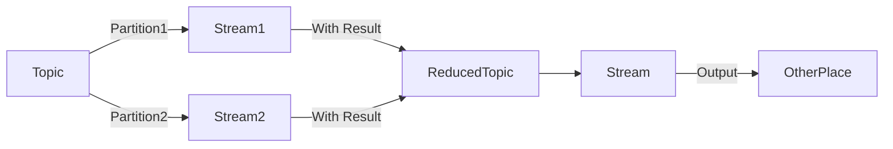

# 1. 流

## 1.1. 数据流（事件流/流数据）

无边界（即无限和持续增长）数据集的抽象表示。

该模型除了无边界外，有下列特点

- 有序：流中的事件发生有先后顺序
- 不可变数据记录：事件一旦发送，不能改变
- 可重播：可以重播以前的原始事件流

## 1.2. 流式处理基本概念

一种编程范式，实时处理1个或多个事件流。

流定义不依赖任何框架，API或特性，只要**持续**从数据就中读取数据，然后处理生成结果，就是流式处理。

> 范式比较：请求与响应，批处理，流式处理
>
> - **请求与响应**：延迟最小的范式，处理模式通常是阻塞的，应用向处理系统发出请求，然后等待响应。（数据库领域叫做OLTP）
>
> -  **批处理**：高延迟，高吞吐量。处理系统按照设定时间启动一次处理，读取可用数据，输出结果，然后等待下一次处理的启动。（数据库领域为DWH/BI）
>
> - **流式处理**：延迟介于上面两者之间，处理都是持续进行，无需等待特定的响-应，也不需要在极短时间内得到响应

### 1.2.1. 时间

流式处理中最为重要的概念，因为大部分流式应用操作基于时间窗口（从而解决乱序问题）。

时间是流处理的基础，绝大部分场景都对时间又严格要求。

- **事件时间**：事件发送的事件和记录创建的时间
- **处理时间**：应用收到事件后要对其进行处理的时间（不可靠，尽量少使用）
- **日志追加时间**：类似Kafka里，这个时间指事件保存到broker的事件（一般和流式计算没太大关系）

### 1.2.2. 状态

在流中，事件与事件之间的信息被称为“状态”，如某个时间段每种类型事件的个数。

这些状态保存在应用的本地变量里，且要小心持久化最近的状态。

状态类型有：

- **本地状态/内部状态**：只能被单个应用实例访问，一般使用内嵌的数据库维护管理。优势在于速度，劣势在于受内存大小限制（所以很多流式处理的设计模式将数据拆分到多个子流，以可以使用有限的本地状态）
- **外部状态**：使用外部的数据存储来维护，一般用NoSQL系统。优势在于没有大小限制且可被多个应用实例访问，劣势在于引入了更大的延迟和复杂性（所以大部分流式处理应尽量避免外部存储，而要将数据缓存以减少与外部发生的交互，降低延迟）

### 1.2.3. 流与表——二义性

**表**：记录的集合。包含主键，且包含一系列由Schema定义的属性。可查询到某一时刻的数据状态

**表与流进行对比**：流表示了一系列“变更”的事件。因此，把表转换成流，需要捕捉表的变更，即把`insert`,`update`,`delete`等事件保存到流中（类似于日志）；而把流转化成表，只要应用这些变更事件即可（流的“物化”）

### 1.2.4. 时间窗口

大部分对流的操作是基于时间窗口的，流的合并也是基于时间窗口的（即合并发生在同一窗口下的事件）

窗口需要考虑的因素：

- 窗口大小：越小——越快发现变更，噪声更多；越大——变更更平滑，延迟更严重
- 移动频率（即移动间隔）：多少时间窗口移动一次，移动方式大致有2种：
  - 滚动(Tumbling)：移动间隔和窗口大小相等，一个事件只属于一个窗口
  - 滑动(Sliding)：窗口随每一条记录移动（间隔为一条记录），事件可能属于多个窗口
  - 跳跃(Hopping)：移动间隔小于窗口大小，事件同样可能属于多个窗口

窗口可以与时间对齐，也可以不对齐。滑动窗口永远不与时间对齐。

## 1.3. 流式处理的设计模式

### 1.3.1. 单个事件处理

最基本的模式，也叫map或filter模式，因为它常用于过滤(filter)或转换(map, 映射)事件

不需要再程序内维护内部状态，每个事件都是独立处理，因此错误恢复和负载均衡会很容易

动作：读取流的事件，修改它们，然后将它们放到另一个流中。

实现：可使用一个生产者和一个消费者实现

> Kafka Streams API使用：
>
> - 配置
> - 建立流拓扑
> - 启动流

### 1.3.2 使用本地状态

聚合流的信息，特别是基于时间窗口的聚合会使用这种模式。

实现聚合需要维护**流的状态**，这些操作可通过**本地状态**实现

>  Kafka分组聚合保证相同组写入同一个分区，消费者实例只需再对应分区获取事件，即可保证分组

使用本地状态需要解决下面问题：

- 内存使用：必须保证可用，容量足够

- 持久化：确保应用关闭时状态不丢失，且重启/切换到另一个应用实例时可恢复状态

  > Kafka Streams使用内嵌RocksDB来实现持久化。崩溃时，可重新读取Kafka主题上的事件重建本地状态

- 再均衡：分区会被重新分配给不同的消费者。在这种情况下，失去分区的实例必须保存最后的状态， 同时获得分区的实例必须知道如何恢复到正确的状态

### 1.3.3. 多阶段处理和重分区

多个分区（主题）分为不同的子流，各自处理，然后将结果输出到一个或多个新流（主题）中，叫重分区，步骤可以多阶段处理。

类似于Map-Reduce的Reduce步骤，而且通常会有多个Reduce步骤。

### 1.3.4. 外部查找——流与表的连接

流式处理有时候要将外部数据和流集成在一起

然而外部查找延迟很大，解决方案有：

- 缓存数据库信息——管理缓存是挑战
- 捕捉数据库变更事件，将其转化成事件流，流式处理监听这个事件流，并及时更新缓存，然后外部数据和流中事件集成在一起时，延迟降低。（这个过程叫CDC——变更数据捕捉）

**流与表的连接**：即CDC。之所以将这种方案叫作流和表的连接，是因为其中的一个流代表了本地缓存表的变更。

1. 捕捉数据库变更事件，将其转化成事件流
2. 流式处理监听这个事件流
3. 一旦有变更，则更新本地缓存
4. 外部数据填充从缓存中获取

### 1.3.5. 流与流的连接

连接2个流，即将2个流中具有相同key、并且发生在相同时间窗口内的事件（包括结果、状态）匹配起来（也叫基于时间窗口的连接）

> Kafka Streams连接流时，2个流是通过相同的key进行分区的，并且在内嵌的RocksDB里维护了两个流的连接时间窗口，以进行连接操作

### 1.3.6. 乱序事件

要让流处理处理好这些场景，需要做到：

- 识别乱序的事件：检查事件事件，并将其与当前时间比较

- 规定一个时间段用于重排乱序的事件

- 具有在一定时间段内重排乱序事件的能力

  > 对于批处理：当一些事件在作业结束后到达，可重新运行作业更新
  >
  > 对于流处理：上述情况不存在，乱序事件必须和新到达的事件一起处理

- 具备更新结果的能力

  > Stream API将结果写到主题上，通常是压缩日志，只保留每个键的最新值，更新很方便，只要直接写入即可，前面的结果会被覆盖

### 1.3.7. 重新处理事件

有2个变种：

- 使用新版本应用处理同一个事件流，生成新的结果，在某个时间点将客户端切换到新的结果流上

  > Kafka中将事件流长时间保存在可伸缩的存储里，要使用2个版本生成流式处理结果，只需满足：
  >
  > - 将新版本的应用作为一个新的消费者群组
  > - 让它从输入主题． 的第一个偏移量开始读取数据
  > - 检查结果流，在新版本的处理作业赶上进度时，将客户端应用程序切换到新的结果流上

- 修复流式处理应用后，重新处理事件流并重新计算结果

  > 要求重置，即回到流初始处开始处理，并重置本地状态，可能需要清理输出流。Streams提供工具，不过还是推荐上一种方法，更安全。

# 2. 流处理的方式

## 2.1. Event Sourcing

事件溯源。从事件源开始保存应用程序状态，保证每次更改都被保存为事件序列，在有需要的时候，可根据时间日志重建当时状态。

它会完整的描述对象的整个生命周期中经历的所有事件。

## 2.2. Reactive

反应式/响应式编程，根据用户的输入来做出响应，这种动作一般是实时的。

特点：

- 响应性：系统高可用的基础，但更重要的是，响应性意味着可以快速检测问题并处理问题
- 可恢复弹性：系统在面对失败时候，仍然保持响应
- 伸缩性：系统在负载变化的时候仍然保持响应
- 消息驱动：响应式系统依靠异步消息在组件之间建立一个边界，确保组件之间的松耦合和隔离性。这个边界还提供了失败委托，负载均衡，弹性和流控等手段来保证系统的高可用性，这是响应式系统的一个必备特点。

可参考：https://www.reactivemanifesto.org/

Reactive编程已经集成到Spring 5, Spring Boot 2.x中。

## 2.3. CEP

复杂事件处理。

事件即事物的状态信息变化，事物之间的作用的动作。复杂事件处理描述的就是系统如何持续地处理这些事件，对系统对变化的持续反应。不论是个体还是系统，都需要从大量的实践中过滤提取，按照既定的处理反应规则做处理。CEP主要依靠规则语言或者持续查询语言来完成事件的过滤、判断和处理。

## 2.4. Stream Processing

这个流处理架构，从大数据量领域发展起来的实时数据处理模型，其主要强调分布式，高性能，高可靠性。

目前主要有Storm，Flink，Spark Streaming等

可参考：https://www.cnblogs.com/tgzhu/p/7119477.html

## 2.5. SEDA with Actor

**SEDA**：阶段事件驱动架构，阶段式服务器模型，其主要是将复杂的，事件驱动的应用分解为一系列**阶段**，从而避免线程的并发模型带来高负载问题，同时还可以达到解耦，负载均衡，分布式等特性。

**Actor**：包装了消息传输和封装机制，用户只需要面对消息和业务逻辑，因此天然就具有分布式、高并发、无状态的特性；对外提供简单编程接口。

典型的有Kafka Streams等

## 2.6. Change Capture

变更数据捕获。

捕捉数据库插入、更新和删除的动作以生成事件流，并作出相应反应。

Kafka，MySQL等都提供这样的功能