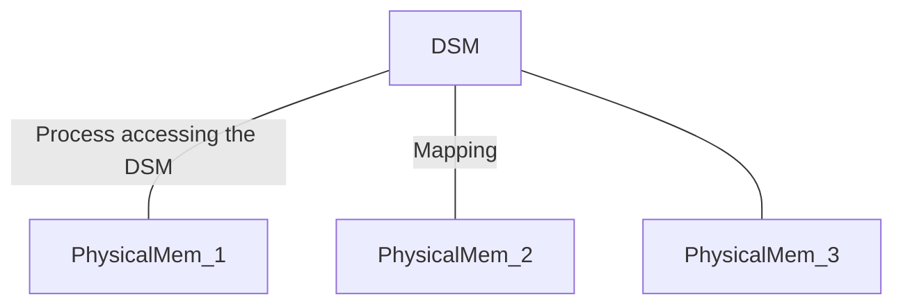

# 1. Overview

**间接通信**: 实体通过中介者通信，发送者和接收者(们)无直接耦合

- 空间解耦：发送者不需要直到接收者的身份
- 时间解耦：发送者和接收者不需要同时存在才能通信

> 空间、时间耦合：消息传递，远程调用
>
> 空间耦合、时间解耦：电子邮件
>
> 空间解耦、时间耦合：IP组播
>
> 空间、时间解耦：大部分间接通信范型

# 2. 组通信

**组通信**：消息先被发送到组中，然后发送到组中所有成员

> 上述动作，发送者不需要知道接收者的身份，只需知道哪个组即可

组通信还可以增加如：组成员管理、故障检测、可靠性和排序保证等功能

应用领域：

- 大量客户可靠消息分发
- 协作应用
- 支持一些容错策略，如复制数据一致更新、高可用复制服务器实现
- 系统监控和管理，包括负载平衡策略

## 2.1. 编程模型

### a) 进程组和对象组

**进程组**：组中，通信的实体的组里的一系列进程

> 相对低级，因为消息被传递到组中的进程，无进一步分发支持；消息也是非结构化的字节数组，不支持复杂数据类型编码

**对象组**：一组对象的集合，并发处理同一组的调用，各自返回响应

> 对象组内部（如消息拷贝）对调用者透明，调用者可通过**组代理**，即可像调用本地方法一样进行组通信

### b) 其它区别

**封闭组与开放组**

- 封闭组：其它组的成员不能发消息给该组成员
- 开放组：其它组的成员可以发消息给该组成员

**重叠组和非重叠组**

- 重叠组：在重叠组中，实体可成为多个组的成员
- 非重叠组：实体至多属于一个组

## 2.2. 实现问题

### a) 可靠性与排序

所有组成员必须受到发给本组的消息的拷贝，且有传递保证，包括：

- 组中每个进程**收到消息**达成的协定——可靠性
- 组成员间消息**传递顺序**达成的协定——排序

> 协定：若消息被传递到一个进程，则该消息被传递到本组的所有进程

**可靠性**

即要保证消息传递的：

- 完整性（接收和发送的消息一样，且没重复传递）；
- 有效性（任何外发消息都会被传递）
- 协定（若消息被传递到一个进程，则该消息被传递到本组的所有进程）

**排序**

组通信要求对传递到多个目的地的消息提供排序的保障（其不能由底层进程间通信原语保证），提供有序组播服务，提供以下一个或多个特性：

- FIFO序/源序：保证了组中所有进程接收到的消息顺序，和发送进程看到消息的顺序一样（*传递消息的顺序*和*发送者看到消息的顺序*可能**不同**）
- 因果序：考虑消息的因果关系，若消息`a`必须在消息`b`前发生，则组中所有进程接收消息时，这种顺序会被保留
- 全序：若一个进程中，一个消息`a`在另一个消息`b`之前被传递，那么相同的顺序在所有组中的进程上维持

### b) 组成员管理

有4个主要任务：

- 提供组成员改变的接口：创建/删除进程组、增加/删除组成员
- 故障检测：检测组成员是否可达（可标记检测是可疑/非可疑的），检测器怀疑组成员不可达时，可考虑从组中移除该进程
- 组成员改变时通知组成员
- 执行组地址扩展：发送者消息只提供了组标识，因此需要将其扩展为当前的组成员的标识

# 3. 发布-订阅系统

**发布-订阅系统**：也即基于事件的分布式系统，将系统自然建模成由事件提供的更为解耦和反应式的编程风格。

- **发布者**：发布结构化的事件到事件服务
- **订阅者**：订阅感兴趣的某类事件或事件模式

发布-订阅系统任务：订阅与发布的事件进行匹配，保证事件通知的正确传递（一对多模型）

**特征**：

- 异构性：使用事件通知时，分布式系统中没有被设计和实现互操作的组件可以在一起工作。（只需要发布者发布提供的事件类型，订阅者的事件模式，用于接收和处理通知结果的接口）
- 异步性：通知是发布者异步发送到订阅者的，不需要同步，即发布者和订阅者是解耦的

> 发布-订阅系统的传递保证功能是可选的，依赖于应用的需求

## 3.1. 编程模型

### a) **操作集**

- `publish(e)`: 发布者将事件`e`发布到发布-订阅系统
- `advertise(f)`: 发布者向系统声明新的事件类型（类似过滤器形式，见下文）
- `unadvertise(f)`: 发布者向系统撤销事件类型的声明
- `subscribe(f)`: 订阅者向系统订阅感兴趣的事件，这里`f`为过滤器，过滤出来自己感兴趣的事件
- `unsubscribe(f)`: 订阅者向系统取消事件的订阅
- `notify(e)`: 发布-订阅系统向订阅者传送/通知对应的事件`e`

### b) **订阅（过滤器）模型**

> 可把订阅看成对事件的**过滤器**，过滤出感兴趣的事件

- 基于**渠道**：发布者将事件发布到命名的渠道，订阅者订阅一个命名的渠道，接受该渠道的所有消息

- 基于**主题**：发布的事件可有一个或多个主题，订阅者根据感兴趣的主题订阅

  > 等价于渠道方法，但是基于渠道的方法主题是隐式的，而基于主题的方法中主题作为一个字段被显式声明了

- 基于**内容**：是基于主题方法的一般化，允许订阅表达式含有一个事件上的多个域，也即基于内容的过滤器是用事件属性值的约束组合定义的一个查询

  > 例如订阅这样的事件：事件类型是`xx事件服务`，且事件作者是`xxx`

- 基于**类型**：与基于对象的方法有内在关联（对象有一个指定的类型），订阅者根据事件类型来，订阅自己感兴趣的类型或其子类型的事件。这种过滤器可表达一定的范围，因为“类型”的粒度大小可控（从整体类型名称，到对象属性方法等）

## 3.2. 实现问题

### a) 集中/分布式实现

**单节点服务器集中实现**

最简单的实现方法，中心服务器作为代理。发布者将事件发布到中心服务器，中心服务器将事件通知到订阅者，订阅者向该中心服务器订阅感兴趣的事件

但缺少弹性和可伸缩性，可能出现单点故障和性能瓶颈

**分布式实现**

在集中实现基础上，将单点服务器代理替换成代理网络（Network of Brokers），即**服务器的集群**，共同提供集中式实现的单点服务器代理的功能

> 也可以用**对等网络**的方式实现发布-订阅系统：即发布者、订阅者、中心代理没有区别，所有结点都是代理，合作实现事件的路由功能

### b) 总的体系结构

体系结构从下到上：

- 网络协议层：可选TCP/IP，IP组播，802.11g, MAC广播等
- 覆盖网络层：包含代理网络、组播、DHT(分布式Hash table)、Gossip协议等
- 事件路由层(核心)：包含泛洪、过滤、汇聚、知情Gossip、广告
- 定层：实现事件和一个给定的订阅进行匹配（也可以推到事件路由层）

**事件路由**

- 泛洪：最简单的路由方法，向所有结点发送事件通知，订阅者自行匹配事件

- 过滤：在代理网络（发布订阅系统中心）中进行过滤路由，通过一个有路径到达有效订阅者的网络来转发通知。

  - 先向潜在的发布者传播订阅信息
  - 然后在代理网络的每个代理存储相关状态，包括
    - 邻居列表：包含该代理结点的所有邻居结点
    - 订阅列表：直接连接该结点的订阅者
    - 路由表：维护该路径上的邻居和有效订阅列表

  对于每个结点`self`，发布消息和接受订阅算法伪码如下:

  ```pascal
  function publish(e:Event):
  	matchList := match(e, subscriptions); //从直接订阅列表中找到匹配的订阅者
  	notify(e, matchList); //通知所有的直接(连接该结点)订阅者
  	forwardList := match(e, routing); //从路由表里找含有匹配的订阅者的代理结点
  	publish(e, forwardList); //转发publish请求到这些代理结点
  
  function subscribe(s:Subscription, x:Node):
  	if x is Client:
  		subscriptions.add(x); // 若x是订阅客户端, 添加到直接订阅列表
  	else:
  		routing.add(x, s); // x是代理网络的另一个结点(邻居)，添加其到路由表并与订阅s绑定
  		subscribe(s, neibours - x); // 向邻居传递订阅事件，保证订阅事件被代理网络的所有结点注册，保证一致性
  ```

- 广告：在有广告的系统中，通过以订阅传播类似（对称的）的方式向订阅者传播广告。

  > 订阅传播本质上采用泛洪的方式向所有可能的发布者推送

- 汇聚：将所有的事件集合看作一个**事件空间**，并将事件空间的责任**划分**到代理网络的代理结点集合上——即定义了**代理结点**：负责一个事件空间的子集的代理结点。

  实现需要一个给定的基于汇聚的路由算法，其必须定义：

  - `SN(s)`：以订阅`s`为参数，返回负责订阅`s`的一个或多个汇聚结点。

  > 汇聚结点需要：
  >
  > - 维护一个订阅列表（直接连接汇聚结点的，类似于上文的“过滤”方法的代理结点）
  > - 将所有的成功匹配的事件转发到订阅节点集合
  >
  > 汇聚结点的概念可参考"网关"概念
  >
  > **一个系统会有很多结点，而特定的请求都会被转发到特定的汇聚结点进行处理**

  - `EN(e)`: 事件`e`被发布时，该函数返回一个或多个汇聚节点，这些结点负责在系统中将`e`和订阅匹配

  `SN(e)`和`EN(e)`可优化以实现自然的负载均衡

  发布消息和接受订阅算法伪码如下:

  ```pascal
  //假定发送者为x, 代理结点为i
  // i不一定是汇聚结点，
  // 汇聚结点是要处理请求的，而非汇聚节点是要转发请求到汇聚节点的
  function publish(e:Event):
  	rvList := EN(e); // 获得需要和事件e匹配的汇聚结点
  	if i in rvList: // 自己是要处理匹配事件的节点时：
  		matchList := match(e, subscriptions); //从直接订阅列表中找到匹配的订阅者
  		notify(e, matchList); //发送通知
  	publish(e, rvList - i);//将publish请求传播给其它汇聚节点
  
  function subscribe(s:Subsription): 
  	rvList := SN(e); // 获得需要负责处理订阅s的汇聚节点集合
  	if i in rvList: // 自己是要处理订阅请求的节点时：
  		subscriptions.add(s); // 添加订阅
  	else
  		subscribe(s, rvList); // 传播订阅到其它汇聚节点
  ```

  > 基于汇聚的路由的一种解释：将事件空间分布映射到DHT散列表中，散列函数可用于将事件和订阅映射到相应的（管理这些订阅的）汇聚节点上。
  >
  > 一个DHT是一种网络覆盖形式，将散列表分不到一个P2P网络节点集合中。

# 4. 消息队列

以**队列**的概念实现间接的**点对点**服务，实现时间和空间解耦。(也称为面向消息的中间件)

## 4.1. 编程模型

生产者将消息发送到特定队列，消费者从该队列中接收消息。

### a) **接收消息方式**

- 阻塞接收：阻塞到有合适消息可用为止
- 非阻塞接收（轮询）：检查队列状态，返回可用消息，或不可用的指示
- 通知操作：当相关队列有消息时，会发送通知给消费者

### b) **排队策略**

- FIFO：最常见的策略
- 优先级策略：高优先级的消息先被传递，消费者也能基于消息的优先级选择消息

### c) 消息的组成

包含：

- 消息目的地：即目的队列的标识符
- 消息元数据：包括优先级、传递模式
- 消息体

### d) 消息持久

消息队列提供消息持久化功能——即会无限期存储消息，会被提交到磁盘，直到被消费为止，以实现可靠通信

> Review: 实现可靠通信需要保证
>
> - 消息都会被收到
> - 接收的和发送的是相同的，且没有消息被发送2次
>
> 消息队列可保证消息能被传递且只有1次，但不能保证传递的时间

### e) 其它功能

- 发送/接收的**事务**功能（保证服务质量）
- 消息转换
- 安全性支持

## 4.2. 实现问题

### 集中式实现和分布式实现

**集中式**

指定一个中心结点的消息管理器管理一个或多个队列（简单，但会有瓶颈和单点故障问题）

**分布式**

如Kafka, ActiveMQ等等，使用的是Broker类（即通过代理）的分布式消息队列。Broker可作为一个集群部署。

它是指有独立部署进行的分布式服务，即发送者把消息发布到Broker进程，再由Broker进程推（或者是拉）给订阅者。 

具体可参考这些消息中间件的实现。

> JMS:
>
> 编程模型包括：
>
> - 用连接工厂创建连接，用连接创建会话
> - 会话可用来创建生产者对象和消费者对象
> - 生产者对象用于发布特定主题的消息或将消息发送到队列
> - 消费者用于订阅某个主题的消息或接收一个队列的消息
>   - 需要指定消息选择器
>   - 提供2中接收模式：
>     - 通知：传入监听器
>     - 阻塞接收

# 5. 共享内存

为并行计算开发的技术

## 5.1. 分布式共享内存

分布式共享内存(DSM)是一种**抽象**，用于给不共享物理内存的计算机共享数据。

读/写看上去和普通内存访问差不多，但是底层对上层是透明的，事实上物理内存是分布式的。



> 上述DSM是一个抽象，进程从DMS访问，实际上分不到不同的物理内存上

### a) 消息传递与DSM

**通信机制的不同**

DSM相比与消息传递而言，不是基于请求-应答通信的，因为DSM在并行处理方面必须使用异步通信

**编程方面**

- 提供的服务：
  - DSM不需要编码和解码，而消息传递需要；
  - DSM的地址空间不受进程保护，而消息传递有；
  - 异构性上，DSM适应性不好，而消息传递有编码的元素可以解决异构性问题；
  - 进程同步实现上，消息传递使用锁服务器实现技术，而DSM使用锁和信号量
  - DSM支持持久化，通过DSM通信的进程可以在非重叠的生命周期中执行；而消息传递有时间耦合性，必须在同一时刻执行消息传递
- 效率：相比于消息传递，DSM并没有劣势
- 开销可见性：消息传递是对程序员可见的，访问是显式的；而DSM可见性较低，因为操作可能不涉及底层运行时支持的通信

## 5.2. 元组空间通信

进程通过在元组空间放置元组，间接通信。其它进程可从元组空间中读/删除元组。

> **关联寻址**：元组没有地址，但可通过模式匹配进行访问（即内容可寻址的内存）

### a) 编程模型

**操作集**

进程在共享的元组空间进行通信，包括以下操作：

- `write`: 往空间添加一个元组
- `read`: 读空间的元组（参数是一个约束条件，返回所有符合条件的元组）
- `take`: 取出空间的元组（参数是一个约束条件）

> 不能修改元组空间的元组内容，元组是**不变的**

**解耦特性**

- 空间解耦：元组可来自任何数量的发送者进程，也可被任何的前在接收者读取/消费
- 时间解耦：元组上传到元组空间后，会被保留，发送者和接收者不需要再时间上重叠

**变种**

- 单一元组空间可扩展为多元组空间，并为其匹配**作用域**
- 元组空间可被分布式实现
- 试验过对元组本身进行就该或者扩展，改变底层语义
- 将带类型的数据项元组转移为数据对象

### b) 实现问题

**集中式 vs 分布式**

同样，元组空间可实现为集中式，但也有伸缩性和容错的问题。

**分布式解决方法：复制**

保证一致性，副本需要：

- 必须从相同状态开始复制（如一个空的元组空间）
- 以相同顺序执行事件（可由**全序组播**算法保证）
- 每个事件必须做出确定的反应

有许多种复制方法，以Xu和Liskov提出的方法为例：

> **视图**：一致的元组空间副本集
>
> **元组逻辑名称**：这里定义为元组的第一个字段

- `write`: 通过不可靠信道上向视图的所有成员发送组播消息实现

  - 向视图的所有成员发送组播消息
  - 成员放置元组到它们各自的副本，并确认收到
  - 再次重复发送`write`请求直到收到所有确认（副本必须检测和确认重复的请求，但重复的`write`不实施写动作）

- `read`: 

  - 向所有副本的成员发送组播消息
  - 每个成员从副本寻找一个匹配的元组，返回自己找到的元组结果
  - 有很多这样的匹配结果，最终只返回第一个收到的，忽略其它的

- `take`: 

  阶段1——选择要删除的元组

  - 向所有副本成员组播`take`请求
  - 每个成员收到请求口，请求相关元组集合上的**锁**（读/写都不用上锁），若不能获得锁，`take`被拒绝
  - 每个成员返回匹配的元组集合作为相应
  - 重复第一步，直到所有成员接收请求、用它们的元组集合进行响应且它们返回的交集是非空的
  - 从交集中随机选择一个元组作为操作结果
  - *若只要少量成员接收请求，那么前面加的锁应该被释放，任何重复第一步

  阶段2——删除选中的元组

  - 组播所有成员`remove`请求，包含要删除的元组引用
  - 成员接收到请求后，删除副本里的元组，返回确认，释放锁
  - 重复第一步，直到收到所有的确认（副本必须检测和确认重复的请求，但重复的`remove`不实施删除动作）

其语义：

- `read`: 阻塞，直到第一个副本返回响应结果为止
- `take`: 阻塞到第一阶段结束为止，即达成删除元组的一致意见
- `write`: 可立即返回

其它的限制（解决并发问题）：

- 每个成员再副本上的操作都必须按其请求者发出的相同顺序执行（即满足源序）
- `take`在所有成员操作完之前，`write`不能再任何副本上执行

**实例**：Java的JavaSpaces工具

# 6. 总结

|          | 组通信   | 发布-订阅系统         | 消息队列 | 分布式共享内存 | 元组空间      |
| -------- | -------- | --------------------- | -------- | -------------- | ------------- |
| 空间解耦 | 是       | 是                    | 是       | 是             | 是            |
| 事件解耦 | 可能     | 可能                  | 是       | 是             | 是            |
| 服务风格 | 基于通信 | 基于通信              | 基于通信 | 基于状态       | 基于状态      |
| 通信模式 | 一对多   | 一对多                | 一对一   | 一对多         | 一对一/一对多 |
| 可伸缩性 | 有限     | 可能                  | 可能     | 有限           | 有限          |
| 关联性   | 无       | 仅基于内容的发布-订阅 | 无       | 无             | 有            |

