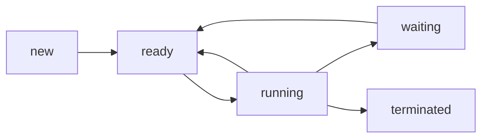

# 1. 操作系统层

位于计算机硬件之上，中间件之下

## 1.1. **至少具备的特性**：

- 封装：封装访问资源的服务接口
- 保护：防止资源非法访问
- 并发处理：资源可被并发访问，保证并发透明
- 通信：接收网络/计算机内部的操作参数并返回结果
- 调度：操作被调用时，必须在内核或服务器上调度相应的处理

## 1.2. **核心组件**：

- 进程管理器：负责进程创建和操作

> 进程包括一个执行环境和一个或多个线程，是资源管理单元

- 线程管理器：负责线程创建、同步、调度

> 线程是与进程相关的调度活动，是CPU调度单元

- 通信管理器：负责不同进程中线程之间的通信
- 内存管理器：负责管理物理内存和虚拟内存
- 硬件管理器：负责处理中断、系统调用Trap和其它异常，同时控制内存管理单元和硬件缓冲以及处理器和浮点寄存器的操作

# 2. 保护 

OS能保护资源以防止非法调用

- 一种方法是使用类型安全的编程语言，
- 也能用硬件支持来保护模块以防止其它模块的非法调用（需要有系统内核的支持）

### 内核与保护

内核在系统初始化后一直保持允许，且对主机的物理资源有完全访问权限

保护措施有：

- 处理器有硬件模式的寄存器，决定特权指令是否能执行（内核进程有特权，其它进程没特权）
- 内核建立自己的内核空间保护自己和其它进程，防止异常进程访问，当然也给正常进程提供所需的虚拟内存

> 进程不能访问自己地址空间意外的内存空间
>
> 进程在用户级地址空间执行 --> 通过中断和trap --> 进入内核空间执行内核级代码 --> 返回用户空间

# 3. 进程与线程

进程包括：

- 执行环境
  - 地址空间
  - 线程同步和通信资源（如信号量、套接字）
  - 高级资源（如打开的文件）
- 一个和多个线程

> 进程可比喻成有资源且有一只苍蝇的瓶子
>
> 苍蝇就是线程
>
> - 可生成子线程
> - 和外面进程通信
> - 消耗/使用进程资源

## 3.1. 地址空间

**地址空间**：管理一个进程虚拟内存的单元，由一个或多个区域组成，区域被不可访问的虚拟内存区隔开。

> 基于页的内存区域包括：范围、对本进程的线程的RWX权限、是否能向上向下扩展

UNIX地址空间包括几个不相交的区域，包括：

- 固定不可更改的TEXT区
- 堆区
- 栈区（每个线程栈区独立）
- 额外区域，如可有
  - 内存映射文件
  - 共享内存区域（物理区域同一片，但可属于其它进程的地址空间的一个或多个区域）
    - 库代码
    - 内核资源（如32位Linux系统3GB~4GB的内存空间）
    - 数据共享和通信区域

## 3.2. 新进程生成

> UNIX可用`fork`拷贝/重用执行环境以创建新进程，`exec`替换父进程空间内容来创建子线程

分布式系统创建进程非划分为2个方面

- 目标主机选择
- 创建执行环境和一个初始线程

### a) 进程主机选择

由**负载共享**实现，可以是：

- 集中化：用中心的负载管理器
- 层次化：树形实现，将权限尽量交给底层结点
- 分散化：系统的结点之间为制定分配决策可直接交换信息

进程**分配策略**需要使用下面2个策略，包括：

- **转移策略**：决定新进程是在本机运行还是转移到其它机器上运行（取决于本机结点负载的轻重）
- **定位策略**：选择哪一个结点驻留被转移的新进程
  - 可以说静态的或适应性的

### b) 创建新执行环境

两种方法：

- 当地址空间格式是静态定义时，直接按照格式进行创建，然后将不同区域初始化（如用可执行文件初始化，或填充0）

- 根据已存在的执行环境定义地址空间

  - 如`fork`，子进程共享父进程正文区域，堆和栈区域是父进程的拷贝（最初是逻辑上的拷贝，而非物理上的，使用写时拷贝技术）。共享的区域，属于父进程的页面同时被映射到子进程的区域中

  > Copy-on-write: 写时拷贝，`fork`的优化，默认的拷贝是不进行物理拷贝，两进程的(逻辑/虚拟内存)页面共享同一块物理帧区域，只有某一进程的页面被修改才会进行物理页面拷贝

## 3.3. 线程

> 吞吐量：每秒处理的请求数

### a) 多线程服务器体系结构

- **工作池体系结构**：服务器创建一个固定的工作线程池来处理请求。请求被放到队列中（常由一个I/O线程放置），然后线程池中的线程从队列获取请求，并处理。缺点是缺乏灵活性，且I/O线程和工作线程切换有额外消耗。

  > 队列可有多个，且可分配优先级

- **一请求一线程体系结构**：服务器有一个I/O线程接收请求，每个请求派生一个新的工作线程处理，处理完后派生的工作线程会被销毁。吞吐量提高了但是创建/销毁线程开销巨大

- **一连接一线程体系结构**：服务器为每个连接分配一个线程，一个连接可有多个请求，客户关闭后销毁这个线程

- **一对象一线程体系结构**：每个远程对象分配一个工作线程，且每个对象都有一个请求队列，I/O线程收到某个对象的请求后，将请求放入对应队列中等待工作线程处理

### b) 客户线程

一般客户端一个线程用于计算，需要单独另一个线程用于I/O，防止不必要的阻塞

### c) 线程与多线程

**多线程与多进程**：

- 线程创建和管理开销小；
- 线程共享一个执行环境，更易共享资源；
- 同一进程的线程切换（即上下文切换）开销比不同进程的线程切换开销小

**进程状态和线程状态**

- 进程（执行环境）
  - 地址空间表
  - 通信接口、打开的文件
  - 信号量和其它同步对象
  - 线程标识符
- 线程
  - 保存的寄存器
  - 优先级和执行状态（如BLOCKED, RUNNING, READY）
  - 软件中断处理信息
  - 执行环境标识符

### d) 线程编程/并发编程

相关概念可参考《操作系统概念》，这里省略

> 竞争条件、临界区、监视器、条件变量、信号量

**线程生命周期**

操作系统中有：`new`, `ready`,`running`,`terminated`, `waiting`

以JVM为例有：

- `NEW`: 线程刚被创建，还没启动
- `RUNNABLE`: 可运行状态，包括了`ready`和`running`
- `BLOCKED`: 等待monitor时被阻塞（即`synchronized`）
- `WAITING`: 等待另一个线程的动作，如`LockerSupport::park`,`Object::wait`, `Thread::join`，以及一些阻塞的操作
- `TIME_WAITING` : 有时限的等待，如`Thread::sleep`,`wait, join, park`指定超时值
- `TERMINATED`: 线程退出

**线程同步**

3类经典问题：生产者消费者、读写者、哲学家问题。

> JVM：
>
> - `synchronized`使用monitor
> - `wait`在`Object`实现，需要先获取该对象实例的monitor（配合`synchronized`使用），然后才能使用，使用后，monitor释放，线程阻塞，需要通过该对象实例的`notify`后才能继续
> - 显示锁`Lock`（如`ReentrantLock`)使用`AQS`，但是其内部一个队列，大量使用CAS，具体可看源码分析

**线程调度**

分为抢占性和非抢占性，有各自的算法（如FIFO, RR，多级队列反馈等等），可参考《操作系统概念》

# 4. 通信和调用

## 4.1. 调用性能

### a) 调用开销

除了**是否异步**（调用后直接返回，执行时间未知，结果可以通过轮询、回调、信号/中断等方式获取）

> 非阻塞和异步调用：其实没什么太大关系，但有区别，以`read`为例：
>
> - 非阻塞`read`: 直接返回（不阻塞）任何可用数据
> - 异步`read`：调用需要完整执行，但是时间未知。可直接返回（不阻塞），通过轮询、回调、信号/中断获取结果（但也可以阻塞）

最大的因素在于：

- **是否涉及域转换**（即是否跨越了地址空间）
- **是否涉及网络通信**
- **是否涉及线程调度和切换**

### b) 网络的调用

**空调用（RPC/RMI）开销**：度量了延迟

**除网络传输之外的延迟因素：**

- 编码/解码
- 数据拷贝，包括在：
  - 跨越用户-内核边界
  - 跨越协议层
  - 网络接口和内存缓冲区（这常由DMA处理）
- 包初始化
- 线程调度和上下文切换
- 确认等待：和RPC/RMI协议选择有关

### c) **内存共享**

可用于用户进程和内核之间/用户进程和用户进程之间的快速通信。即往共享区域写/读数据以通信，不需要从/向内核空间拷贝数据。但是要保证进程的同步。

### d) 协议选择

TCP在传输大数据的时候可能比UDP快，但是其缓冲机制和连接开销比UDP大的多，拥塞控制（如慢启动算法）也会带来不必要的延迟

> 因此HTTP 1.1支持了持久连接，可将多个请求放在一个TCP连接中，减少TCP额外开销的影响

### e) Lightweight RPC

LRPC: 用于一台计算机内部进程间的调用的优化。只要有足够的调用抵消内存管理开销，本机LRPC比RPC效率更高。

参数只拷贝一次，操作为：

- 客户端复制编码后的参数到共享内存空间（A栈）
- 通过客户端存根陷入内核
- 调用到服务端存根出内核
- 从A栈获取参数（不需要复制，因为共享），执行结果，将结果复制到A栈中
- 陷入内核，返回结果（客户从A栈获取结果）

> 相比传统RPC，参数要复制4次：
>
> - 客户存根要把参数从自己程序的栈复制到消息中
> - 消息传送，复制到服务端的内核缓冲区
> - 内核缓冲区复制到服务器消息中
> - 服务器消息复制到服务器存根的栈中

## 4.2. 异步操作

应付高延迟的常用技术。在2种编程模型种出现：**并发调用**、**异步调用**。

### a) 并发调用

多个阻塞请求并发进行。如HTTP请求，使用多个线程请求并获取资源（即HTTP流水线调用），比串行执行所花时间少，延迟会降低。

### b) 异步调用

调用者进行的是非阻塞调用，只要**创建调用请求信息**并**进入准备发送状态**，调用就**直接返回**了

客户需要使用单独的调用收集调用结果：

- 轮询
- 传入回调，当完成后触发
- 触发信号/中断

> Java中，可向线程池`submit`一个异步调用，返回`Future`对象，调用者可通过`get`获取结果，该动作一直阻塞到结果准备好/超时为止（阻塞时，线程状态为`WAITING`/`TIME_WAITING`），也可通过`isDone()`检查是否准备好

### c) 持久异步调用

试图无限执行调用（传统调用都会给定一个超时时间值，不论同步还是异步，但这个值往往不能适应连接中断/长延迟的情况），直到直到调用成功或失败，或应用程序取消调用为止

会有如下问题：调用结果未知情况下，如何在客户设备上继续使用其它应用程序

# 5. OS体系结构

## 整体内核/微内核

- 整体内核：所有基本功能都在一个巨大内核里，且功能并非以模块方式编码（如UNIX）

> 难以管理，但执行效率高

- 微内核：内核只提供基本抽象（如地址空间、线程、本地进程通信），其它服务都由各个模块提供，可动态加载（如Mach）

> 易于管理和扩展，但效率较低

两者内核结构可以混合使用，如macOS

# 6. OS层虚拟化

虚拟化有底层物理机器体系结构上的一个软件层实现，即**虚拟机监控器**/**超级管理程序**

**完全虚拟化**：虚拟机监控器提供底层物理体系结构一样的接口，可让已有的OS不用修改地运行在虚拟机监控器上，但性能不好

**半虚拟化**：在完全虚拟化基础上，允许修改接口以提升性能，但OS需要修改以适配新接口

